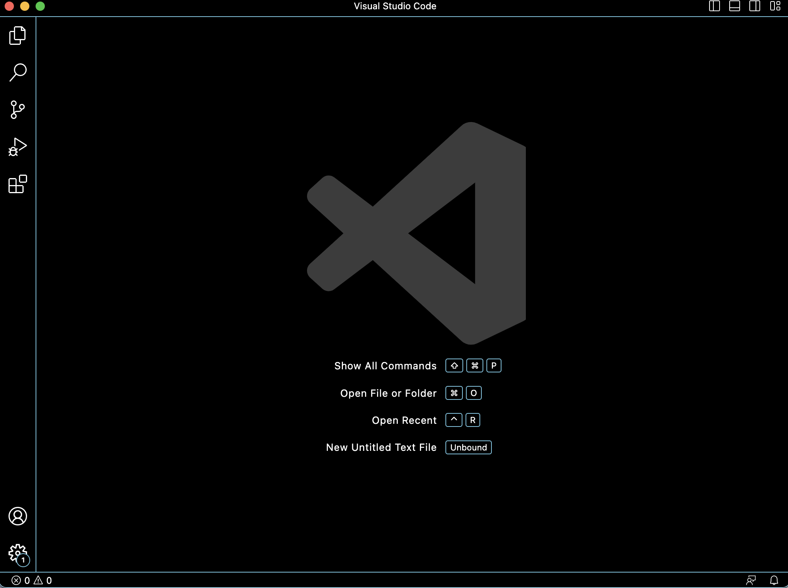
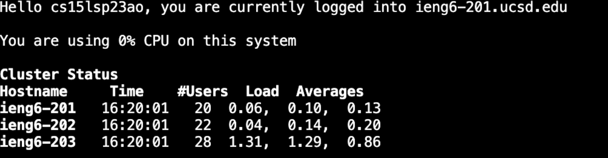
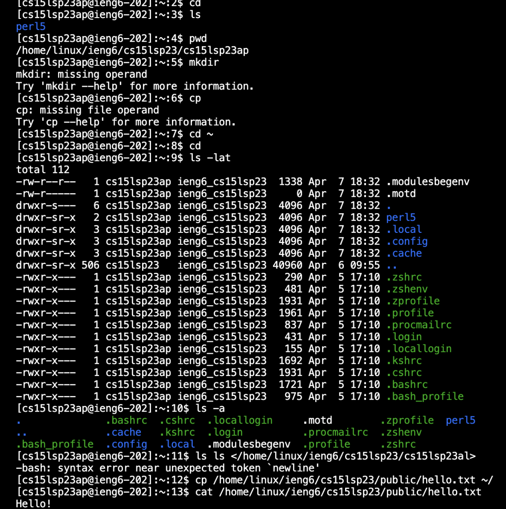

# Lab Report 1: Connecting to a Remote Server


## Step 1 - Download Visual Studio Code (VScode)
VScode is a source-code editor that we will be using to edit and work on our code.
Click on the link- [https://code.visualstudio.com](https://code.visualstudio.com), to download the respective, stable, version that best suits your operating system. (macOS for Macs & Windows for PCs) Follow the download instructions to install the application on your computer. 

Once installed, VScode should open a window that looks similar to this:

(Your default new window may look differently depending on your system and settings.)



### If you are on Windows:

After the installation is complete, you will need to [INSTALL GIT FOR WINDOWS](https://gitforwindows.org/).

## Step 2 - Your CSE15L Account
CSE15L provides you with an additional account associated with your student ID. This course-specific account gives you access to the computers and servers in the CSE basement. Many other courses may provide you with ETS services. Similarly, you will be able to find your account for the respective class to access any resources needed. 

To find your account, click on the following link- https://sdacs.ucsd.edu/~icc/index.php and follow the instructions. 

Your account password will need to be changed. Click on your **additional account** username, starting with `cs15lsp23` and change your password using the *Global Password Change Tool.* For additional resources, this **[TUTORIAL](https://drive.google.com/file/d/17IDZn8Qq7Q0RkYMxdiIR0o6HJ3B5YqSW/view)** demonstrates how to reset your password step by step. 

## Step 3 - Connecting to the CSE Server Remotely
Once you reset your password, you can use your course-specific account to remotely access a server. Using the VScode, we will use the terminal to use `ssh`. Next to this icon:  make sure that `bash` is the selected. 

To open a new terminal, click on the **Terminal** in the menu bar and in the drop-down menu, select **New Terminal** OR a keyboard shortcut you can use is (Ctrl/Command + ). 

Enter `ssh` as the first argument, and as the second, enter your course-specific username, attached to `@ieng6.ucsd.edu`, which is the server domain. Your command line should look something like this (with XX replaced by your own letters): 

` $ ssh cs15lsp23XX@ieng6.ucsd.edu      ` 

Your first time connecting to the server will give you an output that looks something like this:

```
ssh cs15lsp23zz@ieng6.ucsd.edu
The authenticity of host 'ieng6.ucsd.edu (128.54.70.227)' can't be established.
RSA key fingerprint is SHA256:ksruYwhnYH+sySHnHAtLUHngrPEyZTDl/1x99wUQcec.
Are you sure you want to continue connecting (yes/no/[fingerprint])? 
```

This message you are seeing is completely normal if you are connecting to a new server for the first time. However, if you receive the message often, it could be indicating that the connection is being disrupted by another person. More information here: [Ben Voigt's answer](https://superuser.com/questions/421074/ssh-the-authenticity-of-host-host-cant-be-established/421084#421084).

Continue connecting by entering yes, then enter the password that you changed for your account in step 2 once prompted. ***(For security reasons, your password will not be visible and you will not be able to see what you type. Just press enter when you've typed your password.)*** If you've entered your password and you receive a message that gives you the same password prompt, your password change may still be processing. Wait 10-15 minutes to see if you are able to successfully log in. Otherwise, you will receive a message stating that access has been denied which is due to an incorrect password. 

Once your terminal is connected to a computer in the CSE basement, your terminal should give you a message that looks something like this: 


You should now be able to run any commands remotely from your computer, which is the ***client*** computer on the ***server*** computer in the CSE basement!

## Step 5 - Running Commands
Now that you're somewhat familiar with the terminal, you can try running the following commands *alone* on **your computer** (not connected to the remote server) and the **server computer** to see what happens.
  * `cd` - 'change directories' command allows you to move directories with the given path.
  * `ls` - 'list' command lists the files and folders of the specified directory, or the currendt directory if unspecified. 
  * `pwd` - 'print working directory' command prints the complete path of the current working directory. 
  * `mkdir` - 'make directory' command creates directories (new folders)- follow with desired directory name as argument. 
  * `cp` - 'copy' command copies filies or group of directories into the specified destination- follow with two command line arguments: file/directory origin and destined directiory.

You should notice that the mkdir and cp commands produce a 'missing' error. This happens because `mkdir` *makes a directory* and `cp` *copies files.* Since they are executive commands, they require arguments to execute the function. 

Some other commands that have been tried are:
  * `cd ~`
  * `ls -lat`
  * `ls -a`
  * `ls <directory>` (directory replaced with `/home/linux/ieng6/cs15lsp23/cs15lsp23YY` (with YY replaced by another person's username suffix))
  * `cp /home/linux/ieng6/cs15lsp23/public/hello.txt ~/`
  * `cat /home/linux/ieng6/cs15lsp23/public/hello.txt`

These tests should give you an output that looks something like this:



Finally, to logout of the remote server, use the command `exit` OR Ctrl-D.
