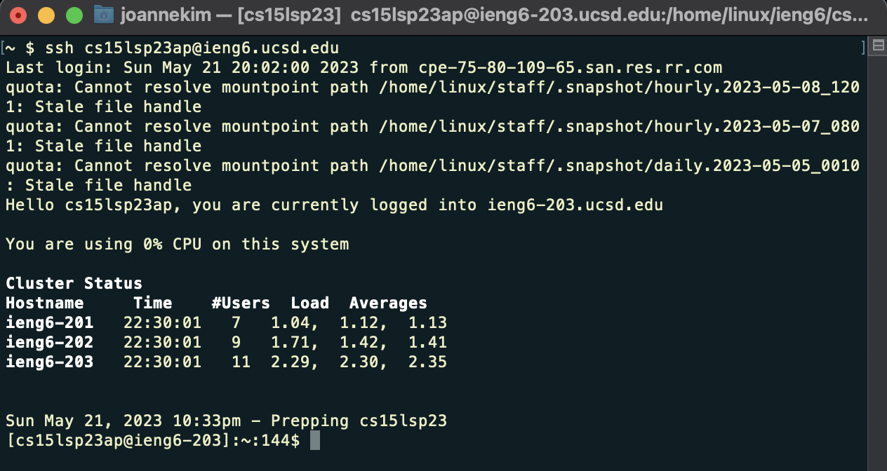
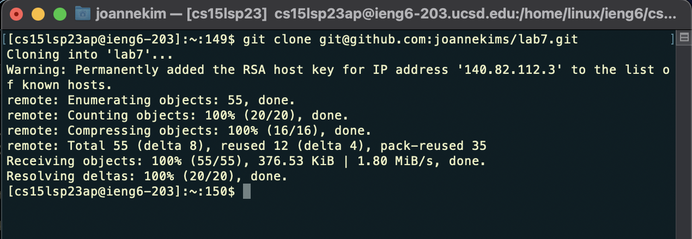
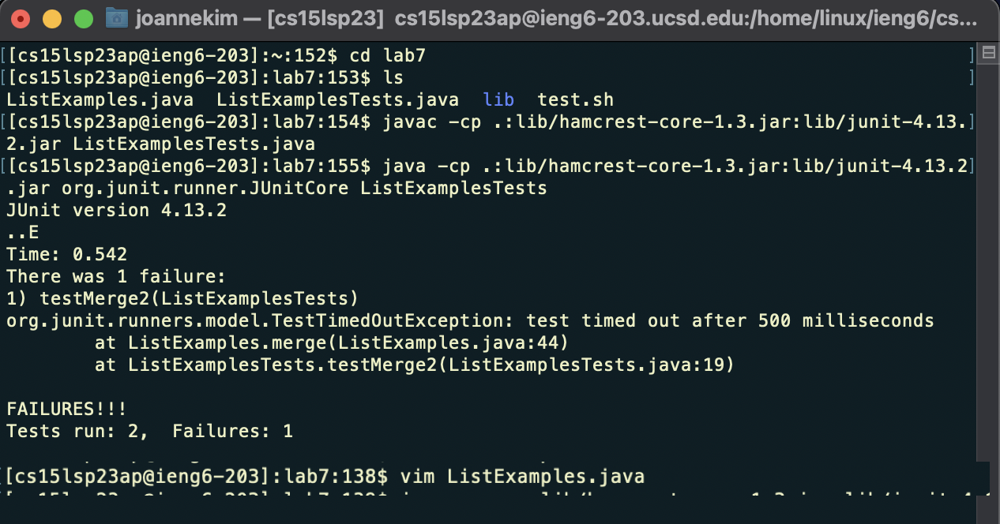
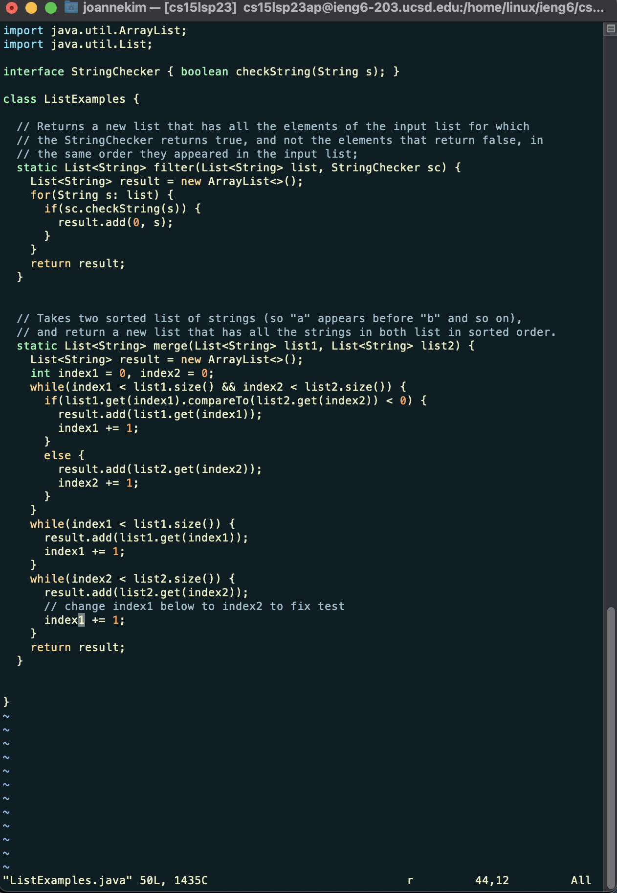
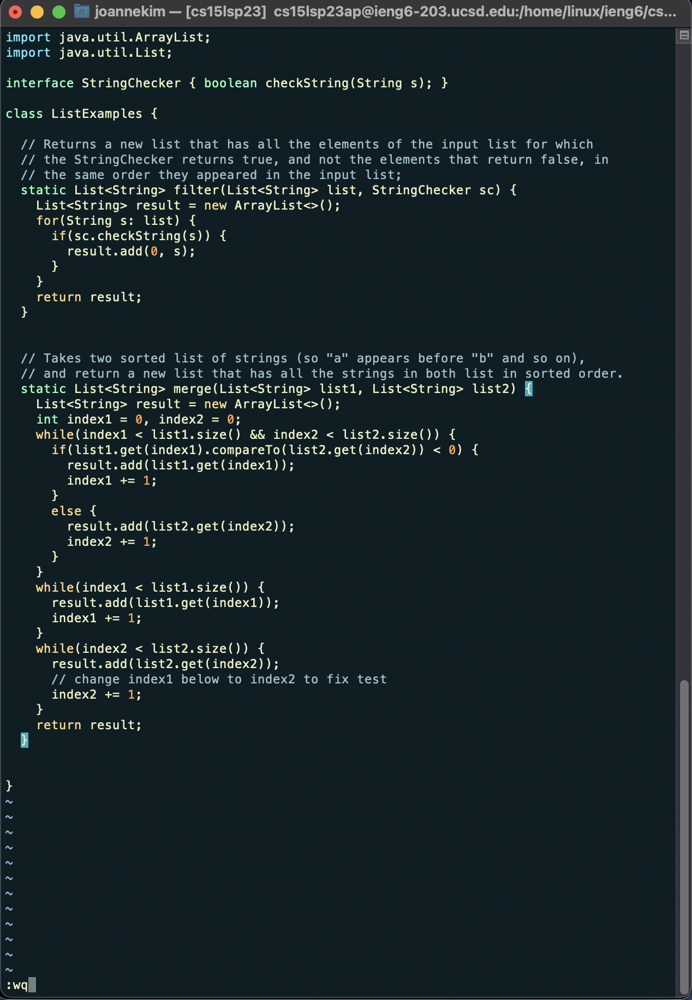
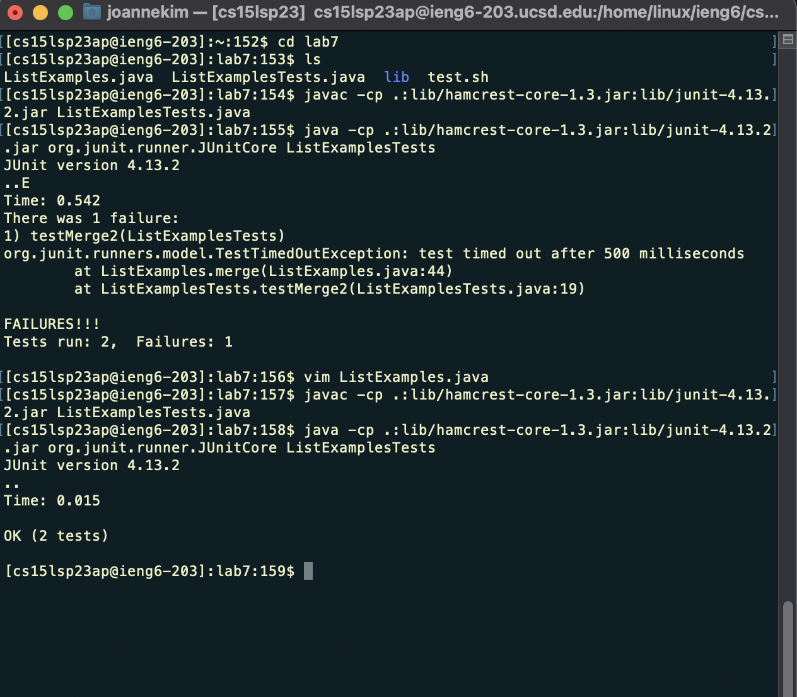
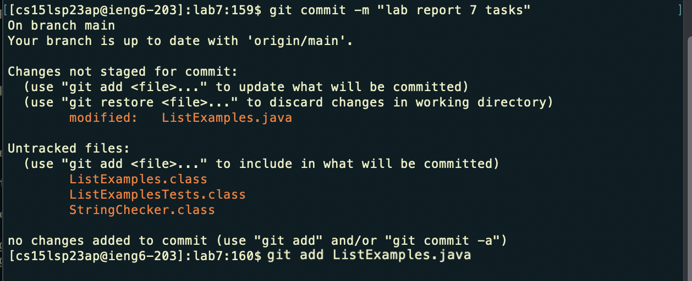
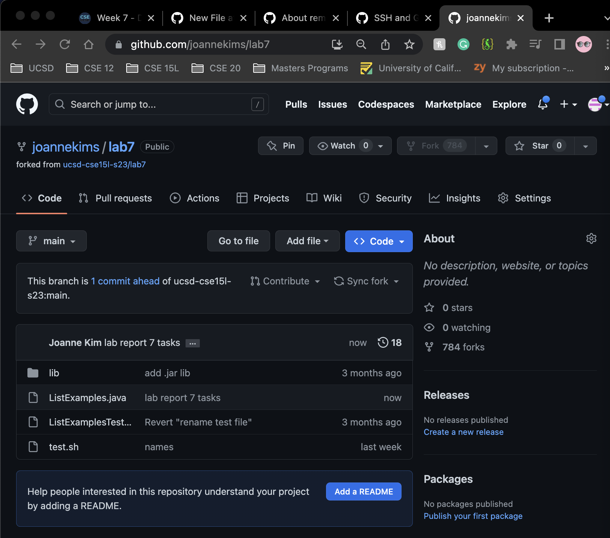

# Lab Report 4, Week 7: Doing it All From the Command Line

## <ins> Steps 4-9: Clone, test, edit, commit, and push ListExamples </ins>
 
### Step 4: Logging into  ieng6
The key strokes to log in-
1. `<ssh>` - to remotely access the ieng6 server
2. `<cs15lsp23XX@ieng6.ucsd.edu>` - your ieng6 account username, *XX* replaced with respective ID

As demonstrated below:

### Step 5: Cloning your fork of the repository from your Github account

After logging in, clone lab7 from your forked repository. Since we've added a new SSH key on our GitHub account, remember to clone the SSH Key when cloning. It should look like this, with the following key strokes to clone into the desired directory-

1. `<mkdir>` - to create a new directory, "lab7"
2. `<lab7>` - typed in addition to `mkdir`
3. `<cd> <lab7>` - to change directories into lab7
4. `<git clone>` - command to clone SSH key
5. `<CMD>` + `<v>` - to paste the copied SSH key from Github account

### Step 6: Running tests on the buggy code

To access *ListExamples.java* we need to enter lab7's directory. The keys/commands pressed to run tests on the file were:
  1. `<cd>` (to change directories) + `<lab7`(to enter lab7 directory)
  2. `<cmd><c>` + `<cmd><v>` (to copy and paste junit compile command) + `ListExamplesTests.java` (typed to compile the ListExamplesTests file)
  3. `<cmd><c>` + `<cmd><v>` (to copy and paste junit execution command) + `ListExamplesTests` (typed to execute ListExamplesTests file)
 

### Step 7: Editing and fixing the bug

As demonstrated in step 6, the tests should have 1 failure because of a bug in ListExamples. Since compiling and running tests were previously completed, the compile and run command as already in the history. However, the keys pressed to edit the code were the following: 
  1. `<vim> <ListExamples.java>` (to access the contents of the file to edit)
 
 Now that we're in ListExamples.java, the keys pressed to get to code we want to edit- *index1* were:
 
  2. `*3k*` (move up 3 rows)
  3. `<l><l><l><l><l><l><l><l><l>` (move left 9 space to land on character to edit- "2")
  
To edit *index1* to *index2*, the keys pressed were: (as demonstrated in the screenshot)

  4. `<r>` (to replace one character with whatever you type next, without entering insert mode)
  5. `<2>` (to change 1 to 2)
  
 

To exit and save the changes made, the keys pressed were: (as demonstrated in the screenshot)

  6. `<esc>` (to enter back into normal mode)
  7. `<:wq>` (to save and quit) 
  
  
  
### Step 8: Running the corrected code
After `<:wq>`, you should have returned to the terminal and ListExamplesTests can be run again to demonstrate that they now succeed. The keys pressed were:
  1. `<up><up><up><up>` (the command to compile the file was already in the history so I used the arrow keys to access it)
  2. `<enter>` (to recompile the file with the new change)
  3. `<up><up><up><up><up>` (similarly, the file being run was already part of the history so I used the arrow keys to access it)
  4. `<enter>` (to run the file with the new change)
  
  
  
### Step 9: Commit and push the resulting change to your Github account

Finally, to commit and push the resulting change into your Github account, the keys/commands pressed were:
  1. `<git commit -m <insert message here>>` (commits these changes, "-m" inserts chosen message, in the dmeonstration below: "lab report 7 tasks")
  2. `<git add> <ListExamples.java>` (add changes to your Github account)

  
  
  
  3. `<git push>` (pushes the changes to your online Github account)
   
   
  
You should now see that *ListExamples.java*'s last commit is "now" instead of "4 days ago" from when lab7 was initially forked from the CSE15L repository! 

   
  
 
