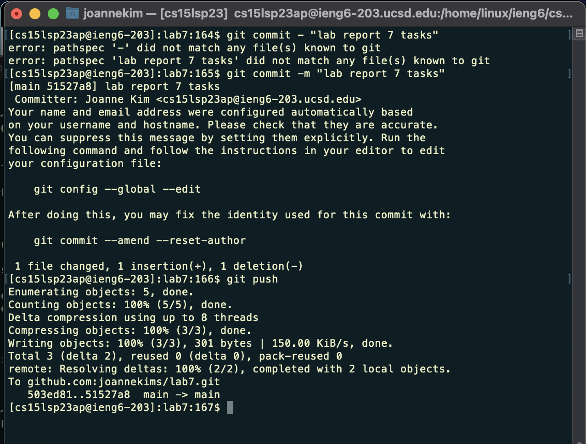

# Lab Report 4: Doing it All From the Command Line

## <ins> Clone, test, edit, commit, and push ListExamples </ins>
1. Log into your ieng6 account. As demonstrated below:

2. After logging in, clone lab7 from your forked repository. Since we've added a new SSH key on our GitHub account, remember to clone the SSH Key when cloning. It should look like this: 

3. To access *ListExamples.java* we need to enter lab7's directory. The keys/commands pressed were:
  * `<cd>` (to change directories into lab7)
5. The tests should have 1 failure because of a bug in ListExamples. To edit the code from the command line in ListExamples, type in *vim ListExamples.java* to access the file. Since these tasks were previously completed, the compile and run command as already in the history. However, the keys pressed to initially demonstrate the failing tests were:
  * `<cmd><c>` + `<cmd><v>` (to copy and paste junit compile command)
  * `<bksp><bksp><bksp>` (to delete ". . ." and enter ListExamplesTests) 
  * "ListExamplesTests" (enter the file with the tests)
 

4. Now that we're in ListExamples.java, the keys pressed to get to code we want to edit- *index1* were:
  * `*3k*` (move up 3 rows)
  * `<l><l><l><l><l><l><l><l><l>` (move left 9 space to land on character to edit- "2")
  
5. To edit *index1* to *index2*, the keys pressed were: (as demonstrated in the screenshot)
  * `<r>` (to replace one character with whatever you type next, without entering insert mode)
  * `<2>` (to change 1 to 2)
  
 

6. To exit and save the changes made, the keys pressed were: (as demonstrated in the screenshot)
  * `<esc>` (to enter back into normal mode)
  * `<:wq>` (to save and quit) 
  
  
  
7. After `<:wq>`, you should have returned to the terminal and ListExamplesTests can be run again to demonstrate that they now succeed. The keys pressed were:
  * `<up><up><up><up>` (the command to compile the file was already in the history so I used the arrow keys to access it)
  * `<enter>` (to recompile the file with the new change)
  * `<up><up><up><up><up>` (similarly, the file being run was already part of the history so I used the arrow keys to access it)
  * `<enter>` (to run the file with the new change)
  
  
  
8. Finally, to commit and push the resulting change into your Github account, the keys/commands pressed were:
  * `<git commit -m <insert message here>>` (commits these changes, "-m" inserts chosen message, in the dmeonstration below: "lab report 7 tasks")
   * `<git push>` (pushes the changes to your online Github account)
   
   
  
10. You should now see that *ListExamples.java*'s last commit is "now" instead of "4 days ago" from when lab7 was initially forked from the CSE15L repository! 

    
  
 
