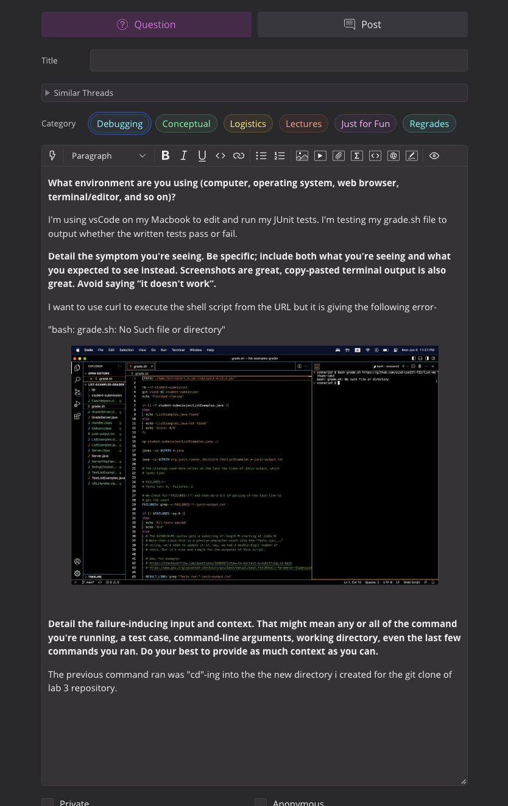
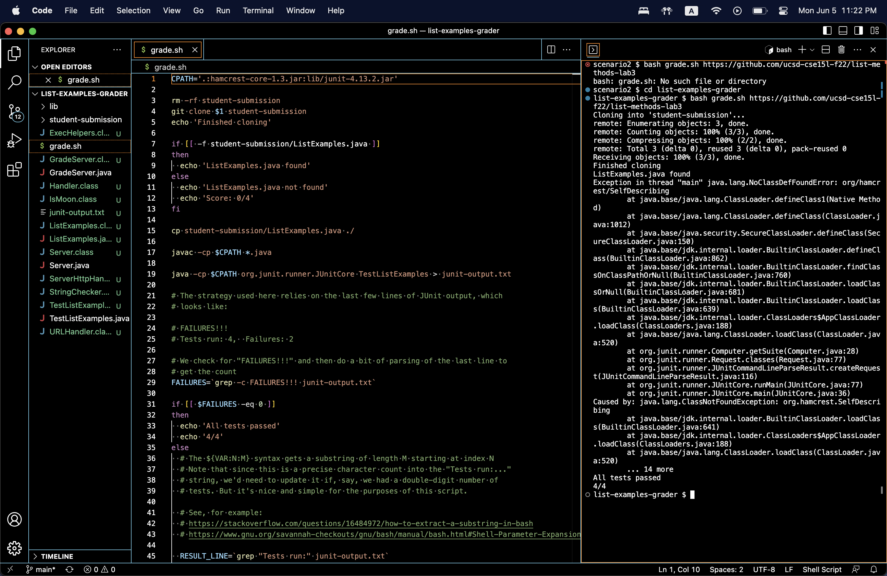
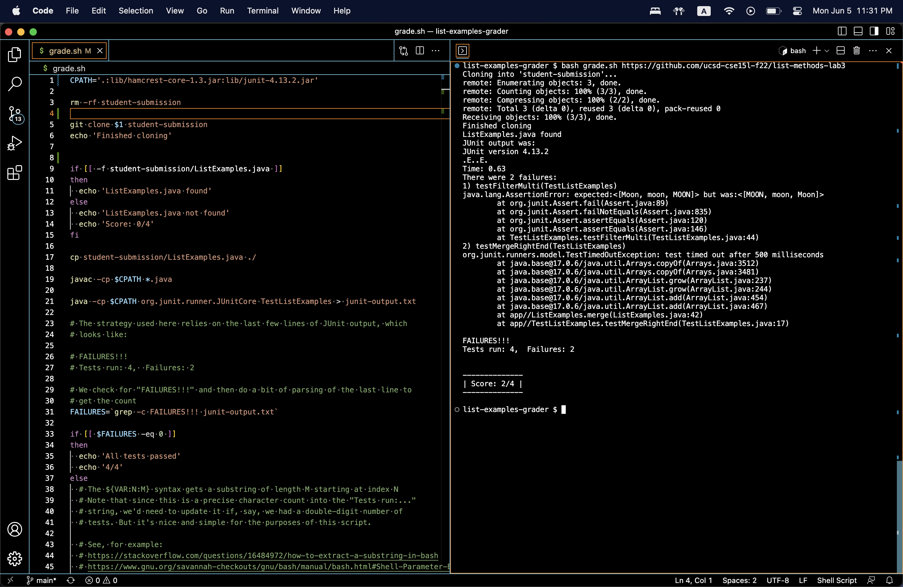

# Lab Report 5 

## Part 1: Debugging Scenario

### 1. Original Post



### 2. TA Response

Are you sure you're in the correct directory to curl grade.sh? Can you double check which directory the bash script file is in?

### 3. Student Attempt

Another screenshot/terminal output showing what information the student got from trying that, and a clear description of what the bug is.



The student was not in the correct directory to curl the bash script file. As demonstrated above, the student changed directories into the correct one and was able to curl the bash script file. However, the student ran into issues despite changing directories into the correct one. This means that there is a bug in the script file. From here, I would ask the student to double check the CPATH and if it is the correct path to compile and execute the file. Which should then remove the error that the student is receiving. 



### 4. All Information Needed
* the file & directory structure needed in this student's case was-  "/scenario2/list-examples-grader". 
* the contents of the file before fixing the bug 
```
CPATH='.:hamcrest-core-1.3.jar:lib/junit-4.13.2.jar'

rm -rf student-submission
git clone $1 student-submission
echo 'Finished cloning'

if [[ -f student-submission/ListExamples.java ]]
then
  echo 'ListExamples.java found'
else
  echo 'ListExamples.java not found'
  echo 'Score: 0/4'
fi

cp student-submission/ListExamples.java ./

javac -cp $CPATH *.java

java -cp $CPATH org.junit.runner.JUnitCore TestListExamples > junit-output.txt

# The strategy used here relies on the last few lines of JUnit output, which
# looks like:

# FAILURES!!!
# Tests run: 4,  Failures: 2

# We check for "FAILURES!!!" and then do a bit of parsing of the last line to
# get the count
FAILURES=`grep -c FAILURES!!! junit-output.txt`

if [[ $FAILURES -eq 0 ]]
then
  echo 'All tests passed'
  echo '4/4'
else
  # The ${VAR:N:M} syntax gets a substring of length M starting at index N
  # Note that since this is a precise character count into the "Tests run:..."
  # string, we'd need to update it if, say, we had a double-digit number of
  # tests. But it's nice and simple for the purposes of this script.

  # See, for example:
  # https://stackoverflow.com/questions/16484972/how-to-extract-a-substring-in-bash
  # https://www.gnu.org/savannah-checkouts/gnu/bash/manual/bash.html#Shell-Parameter-Expansion

  RESULT_LINE=`grep "Tests run:" junit-output.txt`
  COUNT=${RESULT_LINE:25:1}

  echo "JUnit output was:"
  cat junit-output.txt
  echo ""
  echo "--------------"
  echo "| Score: $COUNT/4 |"
  echo "--------------"
  echo ""
fi

```
* the full command line ran to trigger the bug: 
  * `bash grade.sh https://github.com/ucsd-cse15l-f22/list-methods-lab3`
  
* what to edit to fix the bug:
      * In order to correct the bug, the directory must be included in the CPATH to properly execute and run the file. Since the initial CPATH is missing the lib directory, the output is resulting in an error. Instead of: *`"CPATH='.:hamcrest-core-1.3.jar:lib/junit-4.13.2.jar"`*, it should now be *`"CPATH='.:lib/hamcrest-core-1.3.jar:lib/junit-4.13.2.jar'"`*


## Part 2: Reflection

The second half covered a ton of material that was extremely useful in my understanding of the terminal and it's uses. I never understood the point of the terminal if there were many IDEs available to edit and execute programs but it was very interesting to apply the tools learned in class to actually edit the code in the terminal. I thought that vim was super useful to learn as well as all of the vim commands that are needed to utilize the program! 

