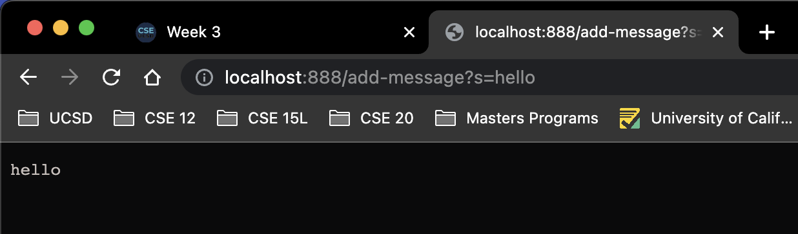
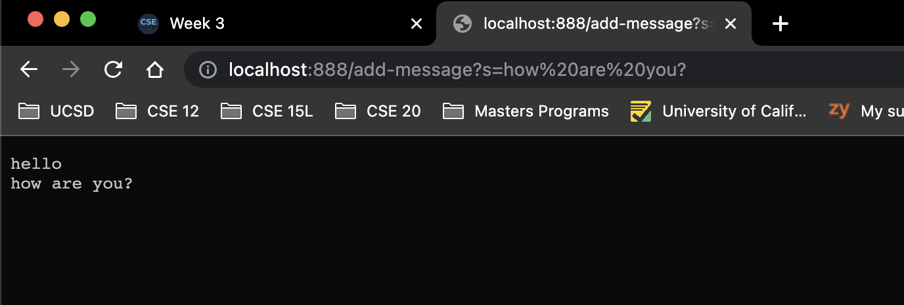
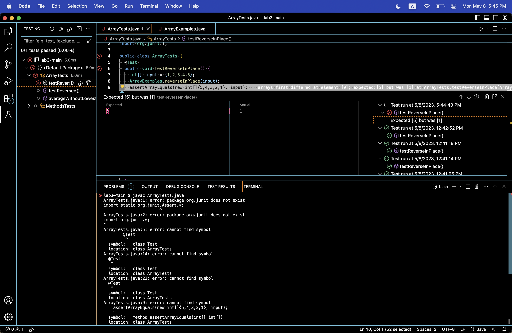
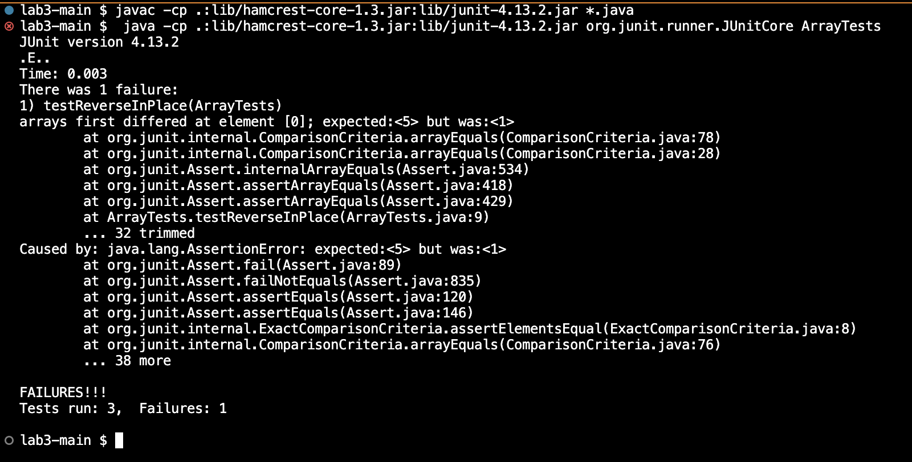

# Lab Report 2: Servers and Bugs

## Part 1
```
import java.io.IOException;
import java.net.URI;
import java.util.ArrayList;

import javax.lang.model.util.ElementScanner14;

class Handler implements URLHandler {
    String queryString = "";
    public String handleRequest(URI url) {
        if (url.getPath().contains("/add-message")) {
                String[] queryList = url.getQuery().split("=");
                queryString = queryString + queryList[1] + "\n";
                }
        return queryString;
    }
}


class StringServer {
    public static void main(String[] args) throws IOException {
        if(args.length == 0){
            System.out.println("Missing port number! Try any number between 1024 to 49151");
            return;
        }

        int port = Integer.parseInt(args[0]);;

        Server.start(port, new Handler());
    }
}
```

#### <ins> Implementation </ins>
First query:


Second query:


The program and the implementation uses method chaining to call 4 methods when the code is executed. The StringServer contains a main method that creates a URLHandler that uses `Server.java` to start a web server using that handler number. The *handler* class implements the *URLHandler* interface to handle the request given in the URL. In this case, the request is adding a string message to the server. This handleRequest method takes in a URI object as the parameter.  
1. `getPath()` - is called on the URL to isolate the path.
2. `contains()` - in the same line that getPath() is called, the URL is chained to the contains() method to decrypt the request, "add-message" in the link. 
3. `getQuery()` - if the URL contains the request "add-message", it proceeds through to the next line and calls getQuery() to isolate the query of the specified URL.  
4. `split()` - the URL is chained from the getQuery() to the split() method. This method splits the Query after the equal sign (=) and deposits the query into a String Array to complete the request.

The relevant arguments, values, and fields to these methods include but are not limited to the following:
1. `queryString` - this string field is initialized as an empty string at the beginning of the handler class. 
2. `URL url` - this url is the parameter of the handleRequest method in the handler class. The path, request, and query is extracted from this url. 
3. `String[] queryList` - this String Array stores the extracted query from the url in the Array. 

Among the relevant values of the *Handler* class, the URI object, `url` and `queryString` changes with each respective request. In every new request, the `url` would contain the entire string which includes the path, request of "add-message" and the query itself. The `queryString` is then used as the reference to the extracted query from the `url`. Then, the then added to the end of the `queryList` to store in the memory. This is what allows the server to retain and print preceeding queries with each new request. 


## Part 2

### <ins> ArrayExamples Bug </ins>

*Failure-inducing input:*
```
@Test 
	public void testReverseInPlace() {
    int[] input = {1,2,3,4,5};
    ArrayExamples.reverseInPlace(input);
    assertArrayEquals(new int[]{5,4,3,2,1}, input);
	}
  ```


*Non-failure inducing input:*
```
@Test 
	public void testReverseInPlace() {
    int[] input = { 3 };
    ArrayExamples.reverseInPlace(input);
    assertArrayEquals(new int[]{ 3 }, input);
	}
  ```
  
  *Symptom:* the array is not reversed, the expected value at index 0 should have been the last element in the array before execution, but was the same element from the input array. Three tests were run and there was 1 failure. 
 
 
 
 
 *Before:*
 ``` 
   static void reverseInPlace(int[] arr) {
    for(int i = 0; i < arr.length; i += 1) {
      arr[arr.length - i -1] = arr[i];
    }
  }
  ```
  
  *After fix:*
  ```
    static void reverseInPlace(int[] arr) {
    for(int i = 0; i < arr.length/2; i += 1) {
      int temp = arr[arr.length - i - 1];
      arr[arr.length - i -1] = arr[i];
      arr[i] = temp;
    }
  }
  ```
  
  *Solution:* The fixed code remedied the buggy code by conditioning the method to halt the method implementation once the middle index is reached. Since the buggy code executed the function for the entire length of the array, the inital switch of elements was reversed back to their original position. The `temp` variable we have initialized is critical as it prevents the value from being lost. We can then assign the index that we want the with the temporary value that we have stored. 
  

  
  ## Part 3
  Lab 2 was simultaneously fun and informative. I was able to learn more about URLs which is prevalent in our everyday lives. I was finally able to understand how the URLs that I've been accessing work and what the different elements of a link mean. I learned how to create and run a server on a remote computer. Learning how to create a webpage and observing how different string concatenations change the behaviors and output on the webpage was another big thing I learned. Additionally, I feel like lab 3 was really good experience for me to learn how to debug. Prior to lab 3, I would blindly try to debug, but with this lab practice, I have a much better idea of how to approach buggy code.
